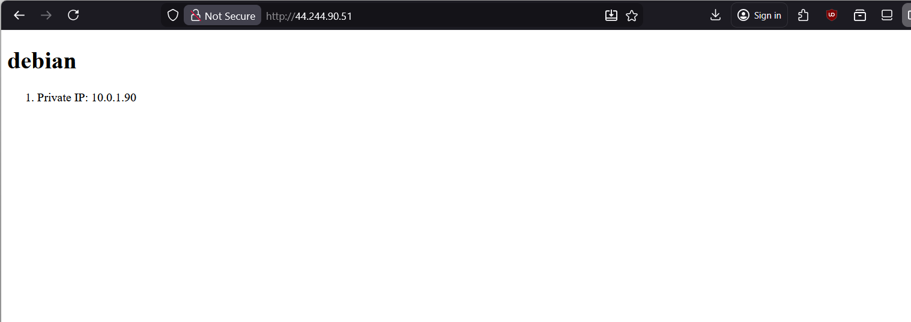

# 4640-in-class-wk10

## 1. Create the SSH key
```
ssh-keygen -t ed25519 -f ~/.ssh/wk9 -C "4640 week 9 lab key"
```

## 2. Run `import_lab_key` script
```
./scripts/import_lab_key ~/.ssh/wk9.pub
```

## 3. Run terraform
```
cd ./packer
packer init .
packer validate .
packer build .
```

## 4. Check the tags
```
ansible-inventory --graph all
```

## 5. Run ansible
```
ansible-playbook playbook.yml --syntax-check
ansible-playbook playbook.yml
```

